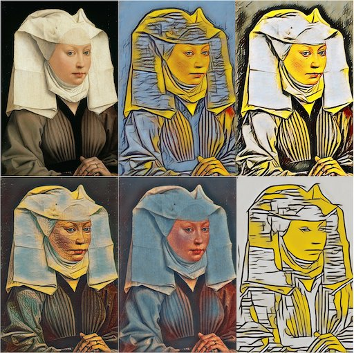
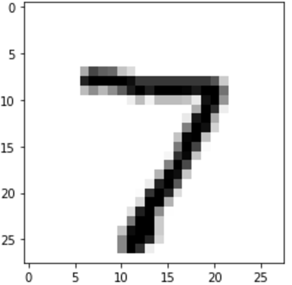

# Welcome to the workshop

* [Agenda](#agenda)
* [Installation instructions](#install)
* [Exercise instructions](#exercise)
* [Next steps](#next)

# Agenda 

In this workshop, you'll explore two approaches to Style Transfer, a technique that blends the *style* of an image with the *content* of another. You'll create beautiful artwork like this:

 
Created using <a href="https://github.com/tensorflow/magenta/tree/master/magenta/models/image_stylization">Magenta<a/>

 
Created using <a href="https://github.com/lengstrom/fast-style-transfer/">Fast Style Transfer<a/>

As time remains - in part two of the workshop, you'll gain experience writing a basic TensorFlow program. We'll work with (you guessed it) handwritten digits. But, our main goal is to get you started exploring Style Transfer.

 
Good olde MNIST.

# Installation instructions
Our goal is to make it as easy as possible for you to particapte in the workshop. You can either bring a laptop, or you may use a loaner Chromebook we will provide on site. Either way, please prepare in advance by following these instructions.

* If you would like to bring a laptop to the event, please choose either [Option 1](#option1) or [Option 2](#option2).
* If you would like to use a loaner Chromebook, please choose [Option 2](#option2).

The easiest way to participate in the workshop is to use a Docker image we've prepared that has everything you need already configured and installed. Options 1 and 2 will guide you through installing that, either on your laptop, or in the Cloud.

### Option 1: Use Docker on your laptop 
Please see these [instructions](markdown/install-and-use-docker.md) to install Docker and learn how to use this image on your laptop.

### Option 2: Use Docker in the Cloud
You can also install our Docker image on a Cloud-based VM. Please see these [instructions](markdown/cloud-install.md) to learn how.

### Option 3: Manual install
If you are an experienced developer and prefer not to use Docker, you may install the libraries you need [manually](markdown/install-manual.md).

# Exercise instructions
Finished installing? Great! Preview the [exercise](markdown/exercises.md) instructions.

# Next steps

### Want to learn more about Style Transfer?
Awesome. Check out these two pages for papers and code:

* [Project Magenta: Image Stylization](https://github.com/tensorflow/magenta/tree/master/magenta/models/image_stylization)

* [Fast Style Transfer](https://github.com/lengstrom/fast-style-transfer/)

### Hungry for more open source projects?
Perhaps you'd like to:

* [Generate music](https://magenta.tensorflow.org/2016/11/09/tuning-recurrent-networks-with-reinforcement-learning/)
* [Parse sentences](https://research.googleblog.com/2016/05/announcing-syntaxnet-worlds-most.html)

### Want to report a bug?
Thanks! Can you please file an issue, or even better, a pull request? We'll be doing this workshop a couple times, and future developers will appreciate your help.

- - -
General disclaimer, this is my personal repo and not an official Google product.