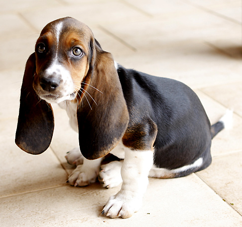
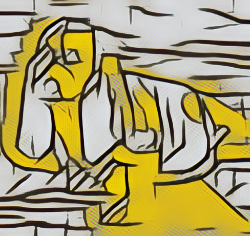
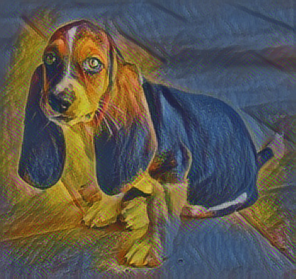
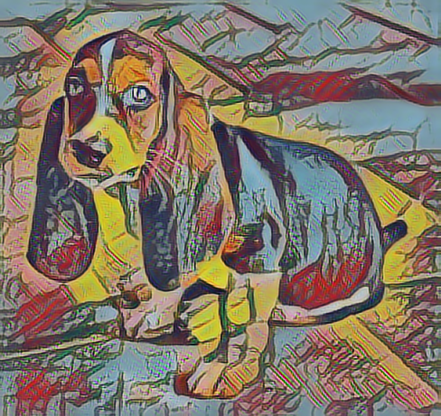
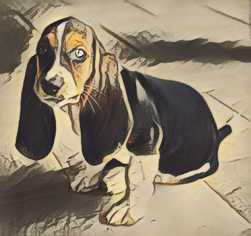

## Project Magenta - Style Transfer Exercise

These instructions assume you're familiar using the workshop Docker image ([locally](install-local.md), or in the [Cloud](install-cloud.md)), and that you have completed the previous [exercise](fast-style-transfer.md) to learn the mechanics of copying images back and forth between your laptop and the running container.

In this exercise, you'll experiment with blending different styles and images, and (optionally) upload your favorites to a shared directory so other participants can take a look. Note: the instructor should have a link to a shared folder on the slides.

## Step 1. Find an image to stylize

*If you are running locally*

As before, download an image and save it to the shared directory on your laptop. There are also sample images you can use inside the container at ```/workshop/sample-images```. We recommend beginning with relatively small images, of around 640x480.

*If you are running on the Cloud*

As before, upload an image using the Notebook Server UI.

## Step 2. Understand the example script

<p align="center"></br>Input image</p>

<p align="center"></br>Output image, using style 0</p>

```
image_stylization_transform \
      --num_styles=32 \
      --checkpoint=/workshop/magenta/multistyle-pastiche-generator-varied.ckpt \
      --input_image=/workshop/sample-images/basset.jpg \
      --which_styles="[0]" \
      --output_dir=/workshop/shared/ \
      --output_basename="basset"
```

To get started, the only argument you'll have to change is ```--input_image``` to point to your image in the shared directory. 

*If you are running locally*

Recall, the shared directory is mounted as ```/workshop/shared```, so if your image is called ```cat.jpg```, then you'll want to change ```--input_image``` to ```/workshop/shared/cat.jpg```).

*If you are running on the Cloud*

Upload an image to the shared directory using the Notebook Server UI. This is mounted inside the container as ```/workshop/shared```.

First, try running this script with the default arguments, and verify you see a stylized image appear in ```~/shared``` when it completes. *If you are running on the Cloud* you will have to refresh your web browser after the script completes. Next, change the ```input-image``` to point to your image, and verify you can stylize it.

## Try different styles
Now it's time to use different styles. You can see images of all the available styles in the pre-trained varied mode [here](https://goo.gl/1UDjBE). Here are a couple:

<p align="center"></br>Style 1</p>

<p align="center"></br>Style 19</p>

Experiment with different styles and input images. If you produce one you really like, considered uploading it for other folks to see.

## Blend styles
You can also blend styles (and even specify how much of each style you'd like!). Here's the syntax. The only argument you'll need to change is ```--which-styles```.

For example:

```
--which_styles="[0,1]"
```

This will equally blend styles 0 and 1. You can blend any number of styles (note: this model has 32 styles, numbered from 0 to 31). Notice the syntax here is a Python list.

You can also use a weighted combination of styles. For example:

```
--which_styles="{6:0.7,7:0.3}"
```

<p align="center"></br>Weighted combination of styles 6 and 7</p>

This will blend style 6 with weight 0.7 and style 7 with weight 0.3. As before, you can blend any number of styles. Notice the syntax here is a Python dictionary of style -> weight.

Experiment with different images and styles, and (optionally) upload your favorites.

### For more details
See [this page](https://github.com/tensorflow/magenta/tree/master/magenta/models/image_stylization).

### Next steps
Why not experiment with generating [music](https://github.com/tensorflow/magenta)? 